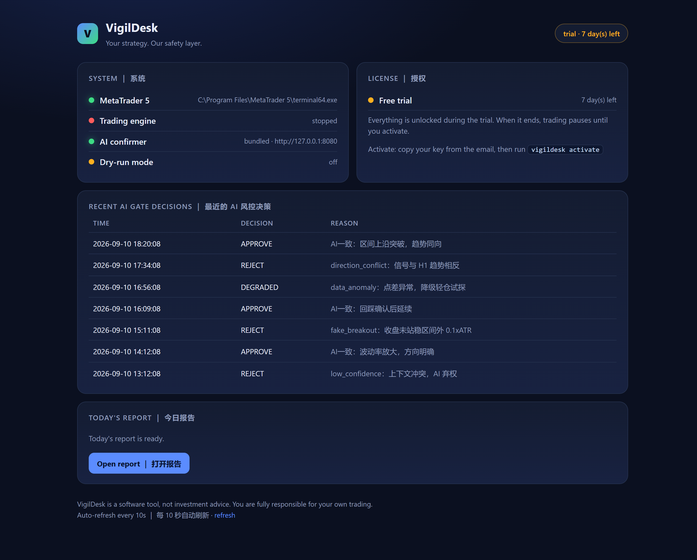

# VigilDesk

> **Your strategy is the steering wheel. VigilDesk is the brake.**

**A local-first safety layer for algorithmic traders.** Kill-switch, hard risk caps, circuit breakers and an audit log that survives terminal restarts — running on your machine, with account data that never leaves it.

> **Status: the project has stopped moving forward.** The paid editions are no longer offered and no payments are accepted. The free MQL5 guard and the engineering notes stay online as an archive.
> ｜ **项目已停止推进**：不再提供付费版本，也不再收取任何款项；免费工具与技术笔记保留作存档。

[🌐 Website](https://xuks124.github.io/vigildesk/) · [📖 Docs & FAQ](https://xuks124.github.io/vigildesk/faq.html) · [⬇️ Free tool](https://xuks124.github.io/vigildesk/free.html) · [🎬 Demo](assets/vigildesk-demo.mp4) · [🧾 Risk proof](https://xuks124.github.io/vigildesk/proof/)

---

## Why this exists

I build strategy scripts to automate the boring parts. The lesson that shaped this project came from a reconnect: **the script logged an error, and my order was still live.**

That incident moved my focus from *"make the strategy smarter"* to *"make failure recoverable."* VigilDesk is the result — a watchdog that halts first and diagnoses later, because in trading the two seconds after a failure are the only ones that matter.

**In plain words:** your strategy decides what to trade; this decides when to stop. It sits next to your setup, watches the account, and hits the brake when something looks wrong — a dropped connection, an order that outlived the script that placed it, a limit that is being exceeded.

**Why you can believe that it works:** because we publish the times it did not. Two of them were ours and they were ugly — a daily loss limit we configured at $50 that our own code silently overwrote with ~$142 (it never fired, and 5 of 42 trading days closed below the limit we believed in), and a restart path that dropped one field and permanently disabled the trailing stop for every adopted position. Dates, numbers and root causes are in **[WHY.md](WHY.md)**.

## Features

| | |
|---|---|
| 🛑 **Kill-switch** | Connectivity loss, feed stalls and API errors halt trading before the damage spreads. |
| 📐 **Hard caps** | Position size, order frequency and daily loss limits that a buggy strategy cannot argue with. |
| ⚡ **Circuit breakers** | Erratic fills, abnormal slippage and unexpected account states trigger a protective stop. |
| 🔁 **Restart-proof state** | Guards persist the trading-day stamp, the day-start balance and the blocked flag — so a terminal restart does not silently hand back the day's full risk allowance. |
| 📓 **Local audit log** | Every halt, cap trip and anomaly is written to a log you own. Account data stays on your machine. |
| 🧩 **Strategy-agnostic** | Works next to any EA, Python bot or manual workflow. Read-only by default; it never places an order on your behalf. |

> 📄 **Deep dive:** why a daily-loss guard must persist its state across restarts — see the [FAQ](https://xuks124.github.io/vigildesk/faq.html).

## What VigilDesk is not

- **No signals.** It does not tell you what to trade.
- **No advice.** It is not investment advice and makes no recommendations.
- **No managed accounts.** It never touches your order path on its own.
- **No performance claims.** Any tool that promised you that would be lying.

It is for traders who already have a strategy and want a safety layer around it.

## Quick start

**Desktop watchdog (Windows)**

1. Download `VigilDesk-<version>-win64-portable.zip` from [the website](https://xuks124.github.io/vigildesk/free.html) (or the [Releases](../../releases) page).
2. Unzip and run `VigilDesk.exe` — portable, nothing is installed system-wide.
3. Point it at your terminal's data folder and set your caps. It starts in read-only mode.

**Free MT5 guard EA (MQL5)**

A minimal, restart-proof daily-loss guard that does the single most important job:

- Source: [`mql5/VigilDeskGuardFree.mq5`](mql5/VigilDeskGuardFree.mq5) — read it, modify it, ship your own version.
- Attach `VigilDeskGuardFree.ex5` to a chart and set your cap. It persists state across restarts and uses the broker's trading day, not your local clock.

## Writing

Notes from building this, written for anyone who has to make trading automation fail safely:

- [Our code silently replaced our own $50 daily loss limit with $142](https://dev.to/xuks124/our-code-silently-replaced-our-own-50-daily-loss-limit-with-142-226k) — the cap that never armed, and how we found it by comparing what we configured against what actually happened.
- [Your daily loss limit resets when MetaTrader restarts. Here is the fix.](https://xuks124.github.io/vigildesk/blog/restart-proof-daily-loss-guard.html) — why in-terminal guards lose their state, and how to make one that survives a restart.
- [Is your guard real or decorative? A checklist](https://xuks124.github.io/vigildesk/blog/is-your-guard-real-or-decorative.html) — twelve questions that separate a guard from a decoration.
- [Memory plus an expiry policy: what a restarted guard is allowed to assume](https://xuks124.github.io/vigildesk/blog/memory-plus-expiry-policy.html) — the hard half of persistence is the assumptions, not the serialisation.
- [Detection is not resolution: the gap that makes guards decorative](https://xuks124.github.io/vigildesk/blog/detection-is-not-resolution.html) — time-to-detect is an engineering metric; time-to-effect describes the damage.
- [Decisionless monitoring: the reports nobody acts on](https://xuks124.github.io/vigildesk/blog/decisionless-monitoring.html) — if a report changes no decision it belongs on a dashboard, not in an inbox.
- [What a kill switch should actually do (and the four ways they fail)](https://xuks124.github.io/vigildesk/blog/what-a-kill-switch-should-do.html) — never armed, never disarmed, wrong trigger, wrong clock.
- [Silent failures in trading automation: the three that cost the most](https://xuks124.github.io/vigildesk/blog/silent-failures-in-trading-automation.html) — guards that read zero, configs that override code, and state that dies with the process.
- [Which day is it? Broker time, host time, and the trading-day boundary](https://xuks124.github.io/vigildesk/blog/which-day-is-it-trading-day-boundary.html) — three clocks can disagree, and the failure is silent.

## Documentation

- [Why we build this](WHY.md) · [Risk proof page](https://xuks124.github.io/vigildesk/proof/)
- [FAQ](https://xuks124.github.io/vigildesk/faq.html) · [Tutorial](https://xuks124.github.io/vigildesk/tutorial.html) · [Prop-firm mode](https://xuks124.github.io/vigildesk/propfirm.html)
- [Security & privacy](https://xuks124.github.io/vigildesk/security.html) · [Legal](https://xuks124.github.io/vigildesk/legal.html)
- [中文主页](https://xuks124.github.io/vigildesk/zh.html)

## Tech notes

- **Python desktop app**, local-first: no accounts, no cloud, no outbound account data.
- Integrates with MetaTrader 5 through its data/log folder — read-only by default.
- State is persisted to disk so protection survives crashes, restarts and recompiles.

## Risk disclosure

Algorithmic trading carries both technical and market risk. No tool eliminates the possibility of loss. Nothing here is investment advice.

---

## 中文

**你的策略是方向盘，VigilDesk 是刹车。** 一个本地运行的交易安全层：断线/异常即停、仓位与频率硬上限、成交异常熔断、**重启不丢状态的风控记录**，数据不出本机。

- 不产生信号 · 不做推荐 · 不代客操作 · 不承诺收益
- 主页 <https://xuks124.github.io/vigildesk/zh.html> · 免费版 <https://xuks124.github.io/vigildesk/free.html>

## License

See [LICENSE.md](LICENSE.md). In short: the website and the free MQL5 guard are free to use and modify with attribution; the VigilDesk application itself is proprietary and covered by its own EULA.
